```{r global_options, include=FALSE}
knitr::opts_chunk$set(out.width = '100%', 
                      echo=FALSE, warning=FALSE, message=FALSE)
```

```{r, eval = FALSE, echo = FALSE}
library(magick)
library(dplyr)
```

__Warning: This post contains spoilers for Game of Thrones seasons 1-7.__

Like [16.5+ million](https://www.nytimes.com/2017/08/28/arts/television/game-of-thrones-finale-sets-ratings-record.html) people across the globe, I anxiously await the return of the eighth and final season of Game of Thrones (GoT) on April, 14, 2019. After a two year hiatus, I wanted to refresh my memory on the plot lines across seasons 1 through 7 before HBO wraps up the conflict.

In preparation, I decided to evaluate the statistical networks between characters across seasons 1 through 7 to consider how the network of characters has changed over time. Last year, I spent the spring [scraping](https://en.wikipedia.org/wiki/Data_scraping) the [scripts](https://genius.com/artists/Game-of-thrones) from the internet and building a GoT statistical network. I assigned a numeric value to quantify connections among characters by how often a character speaking mentions another characters name. For example, if the lines read:

Petyr Baelish (Littlefinger): "...you might have been my child but we don't live in that world. You're more beautiful than she ever was."  
Sansa Stark: "Lord Baelish"

then Sansa has a single directed connection with Petyr. The more times she speaks his name the stronger the connection. Throughout this post [centrality](https://en.wikibooks.org/wiki/Transportation_Geography_and_Network_Science/Centrality#Degree_centrality_2) is quantified as the number of connections, or number of other character names mentioned, a single character has.

<center>
<iframe src="https://giphy.com/embed/5AdXkMHwzUheE" width="480" height="240" frameBorder="0" class="giphy-embed" allowFullScreen></iframe><p><a href="https://giphy.com/gifs/moments-dead-5AdXkMHwzUheE">via GIPHY</a></p>
</center>

The full interactive network is hosted [here](https://alval.shinyapps.io/got_shiny/).

Unfortunately, the data have some limitations that must be addressed. Since this data was collected from [www.genius.com](www.genius.com), a website that houses music and video content generated by users, not all scripts were available. In season 2, scripts were only annotated for episodes 1, 2, and 3 at the time of writing this post. Similarly, season 3 only had a script available for episode 9. Sadly, season 4 was missing scripts for all episodes. With the data available from the remaining seasons and episodes, we can still identify patterns related the character network. Throughout this post, I refer to episodes by season and episode number rather than use the episode title. To cross-reference all episodes titles are list [here](https://en.wikipedia.org/wiki/List_of_Game_of_Thrones_episodes).

## Season 1 

```{r, echo = FALSE, eval = FALSE}
../../static/img = c(magick::image_read(path = "../../static/img/got_network/season1/final/episode1.png"),
        magick::image_read(path = "../../static/img/got_network/season1/final/episode2.png"),
        magick::image_read(path = "../../static/img/got_network/season1/final/episode3.png"),
        magick::image_read(path = "../../static/img/got_network/season1/final/episode4.png"),
        magick::image_read(path = "../../static/img/got_network/season1/final/episode5.png"),
        magick::image_read(path = "../../static/img/got_network/season1/final/episode6.png"),
        magick::image_read(path = "../../static/img/got_network/season1/final/episode7.png"),
        magick::image_read(path = "../../static/img/got_network/season1/final/episode8.png"),
        magick::image_read(path = "../../static/img/got_network/season1/final/episode9.png"),
        magick::image_read(path = "../../static/img/got_network/season1/final/episode10.png"))

season1episodes = magick::image_animate(../../static/img, fps = 0.1)
magick::image_write_gif(season1episodes, '../../static/img/got_network/season1/all_episodes.gif')
```

It is no surprise that the network developed in the first season is mostly described by family ties and geographical location as the conflict and plot lines are revealed. Characters with strong connections tend to be in the same family or in the same location. The first season focuses on the family of nobleman Eddard "Ned" Stark and King Robert Baratheon. Robert travels to Winterfell to ask Ned, his long time friend and ally, to accept the position of King's Hand. Ned and his daughters, Sansa and Arya, move to King's Landing while his wife Catelyn and sons Robb, Bran, and Rickon are left in Winterfell. Jon Snow, Ned's bastard, heads to the wall protect the realm and join the Night's Watch. __Figure \@ref(fig:seas1eps)__ shows each episode network across season 1. In episode 1 the Stark children are connected to their parents with the only non-family member in the cluster being Ned's old friend Robert. Jon Arryn, the previous King's Hand, has been killed and Ned is tasked with discovering the details of his mysterious death.

```{r, seas1eps, echo = FALSE, fig.align = "center", fig.cap = "The season 1 episode networks are presented. The networks are created using data from each unique episode and do not use cumulative information across episodes. The size of the character name indicates the the degree of their centrality."}
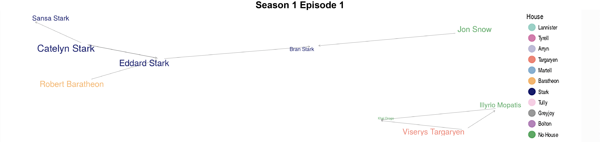
```

While in King's Landing Ned uncovers dark secrets about the Lannister family. Ned disputes the legitimacy of the Baratheon children, Joffrey, Tommen, and Myrcella and claims they have no rights to the Iron Throne. By episode 6, Ned has quickly become connected with Jaime Lannister, Tyrion Lannister, and Petyr Baelish, all powerful advisors or guardians of Robert that reside in King's Landing, the same geographic location as Ned.

In episode 8, the network shifts slightly from family and location described patterns to conflict based arrangements. King Robert is injured while out hunting boar and dies just as Ned tells Queen Cersei he knows all of her children illegitimate and are actually Jaime's. Cersei throws Ned in jail for treason which prompts The North to secede from the Seven Kingdoms. The episode 8 network reflect the House drama merging Lannister, Baratheon, and Stark independent clusters (see __figure \@ref(fig:seas1eps)__). 

Across episodes 4 and 8, Arya Stark is connected to Syrio Forel, a master-sword fighter hired by Ned to train Arya. When Ned is arrested in King's Landing, Syrio helps Arya flea from King's Landing. Sansa is not so fortunate and is instead captured by the Lannisters. She remains promised to marry Joffrey Baratheon, the heir to the Iron Throne in order to form a marriage alliance. Joffrey and Sansa are connected episode 6. Ned is eventually beheaded for his treasonous crimes. 

Similarly, in episode 6, Daenerys and Viserys further evidence the family and location pattern as they form their own cluster. Viserys and Daenerys Targaryen, the son and daughter of the former king, remain exiled in Essos. Viserys marries Daenerys off to Khal Drogo, a Dothraki warlord, who kills Viserys and his over-inflated ego. Throughout the season, these three form their own cluster unconnected to any characters in Westeros. Khal Drogo dies later of infection but in the process leaves Daenerys with three baby dragons and an army to conquer Westeros.

The family-location pattern is even more evident when we create a cumulative network that quantifies the network using data across all episodes in season 1. __Figure \@ref(fig:seas1)__ shows the full season 1 network. To generate this network, the data is combined across all 10 episodes in season 1. The Starks, Baratheons, and Lannisters form a large single cluster with some important peripheral characters like Petyr. Each family cluster is easily identifiable inside the larger network showing the immediate connections are between family members or old friends. Since Daenerys is in Essos, a continent far from Westeros, she forms her own cluster with Viserys, Khal Drogo, and Jorah Mormont.

```{r, seas1, echo = FALSE, fig.align = "center", fig.cap = "The season 1 cumulative network is presented. The network is created using data across all episodes in season 1. The size of the character name indicates the the degree of their centrality."}
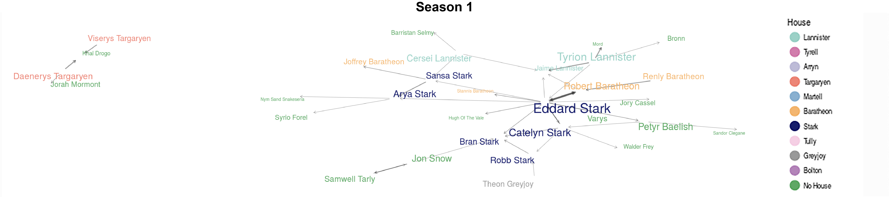
```

The cumulative season 1 network also reveals that Ned is the most central character across the entire season. 

Season 1 sets up major plot lines so its obvious that the series opens with characters are talking to their family or other characters spatially close to them. Just as we are meeting everyone, the show characters are meeting each other.

## Season 2

```{r, echo = FALSE, eval = FALSE}
../../static/img = c(magick::image_read(path = "../../static/img/got_network/season2/final/episode1.png"),
        magick::image_read(path = "../../static/img/got_network/season2/final/episode2.png"),
        magick::image_read(path = "../../static/img/got_network/season2/final/episode3.png"))

season2episodes = magick::image_animate(../../static/img, fps = 0.1)
magick::image_write_gif(season2episodes, '../../static/img/got_network/season2/all_episodes.gif')
```

The network develops quite differently in season 2. With data from only the first three episodes interpreting the overall season network pattern is more difficult due to the missing data. Family and location connections are still present, but there are more conflict based connections in these episodes. Focusing on episode 1 in __figure \@ref(fig:seas2eps)__ there is a prominent cluster connecting Joffrey Baratheon, Robb Stark, Renly Baratheon, Stannis Baratheon, and Jaime Lannister. After Ned's public claims surrounding the royal children and King Robert's death the War of the Five Kings breaks out around the Seven Kingdoms. The five kings that emerge include Robert's supposed heir, Joffrey Baratheon, Robert's two younger brothers, Stannis and Renly Baratheon, Robb Stark the "King in the North", and Balon Greyjoy the "King of the Iron Islands". 

```{r, seas2eps, echo = FALSE, fig.align = "center", fig.cap = "The season 2 episode networks are presented. The networks are created using data from each unique episode and do not use cumulative information across episodes. The size of the character name indicates the the degree of their centrality."}
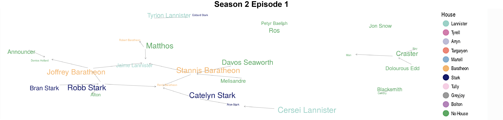
```

A clear pattern presents in the episode networks displayed in __figure \@ref(fig:seas2eps)__ and the season network shown in __figure \@ref(fig:seas2)__ revealing a cluster joining Robb Stark, Cersei Lannister, Stannis Baratheon, Joffrey Baratheon, Tyrion, Catelyn, Stannis Baratheon, and Renly Baratheon the characters fighting each other in civil war. Interestingly, each character fighting for the Iron Throne is distracted by mainly one other character. We do not see each character in conflict with all others fighting but rather tunnel vision and fixation on a single threat. For example, in the episode 1 network Robb Stark is mainly concerned with Cersei Lannister and Joffrey Baratheon in King's Landing while Renly Baratheon is largely concerned with Stannis Baratheon. This is consistent with the plot lines in the show. Robb at the start was mostly concerned with Cersei while Renly was fending off Cersei and Stannis.

```{r, seas2, echo = FALSE, fig.align = "center", fig.cap = "The season 2 cumulative network is presented. The network is created using data across all episodes in season 2. The size of the character name indicates the the degree of their centrality."}
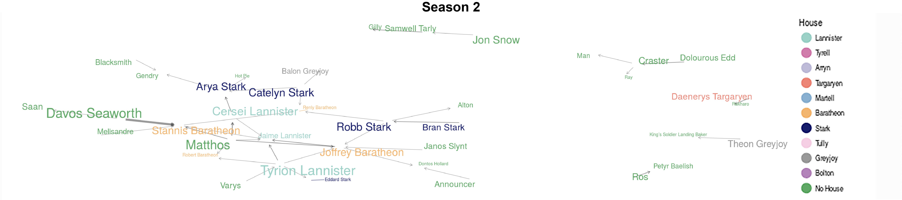
```

Robb sends Theon Greyjoy and his mother Catelyn Stark separately to seek alliances with Balon Greyjoy in the Iron Islands and Renly Baratheon on the battle field while Robb and his army progress South. Robb and his army cross paths with Jaime Lannister and they take him as a prisoner of war. After Theon returns home and reunites with his family he crosses Robb by taking up arms with the Ironborn and recaptures Winterfell for the Iron Islands. Bran and Rickon Stark escape into the wilderness but Theon claims falsely that he killed the Lords. Catelyn fails to convince Renly to align and he is murdered by an evil spirit dispatched by Melisandre "The Red Woman" a Red Priestess working with Stannis Baratheon. Since the only other living people in the room are Catelyn and Brienne of Tarth, Renly's bodyguard, they are accused of the assassination and quickly flee. Catelyn and Brienne later reunite with Robb and devise a plan to take Jaime Lannister back to King's Landing in order to extort Jaime for Sansa.

Location still plays a large role in describing the patterns we see in the character network made clear by the cluster surrounding Jon Snow across all the episodes in the season. Jon's network includes connections with Samwell Tarly and Gilly. Jon ventures beyond the Wall with Sam and some other men in the Night's Watch. Jon is captured by the Wildlings. In order to survive, he defects from the Night’s Watch to join the Wildlings. 

Similarly, location describes the network that follows Arya in season 2. While she is posing as a Night's Watch recruit with Yoren, a sworn brother of the Night's Watch, Arya and the other recruits are captured by Lannister soldiers. Arya's network cluster in episode 2 includes the other recruits Gendry, a bastard son of Robert Baratheon, and Hot Pie, an orphan. Tywin Lannister believes she is in fact a boy and a Night's Watch recruit and takes her as his servant. Arya eventually escapes with the aid of Jaqen H’ghar, a member of the Faceless Men. 

Later in the season, Stannis Baratheon and his army attempt to invade King's Landing through the Narrow Sea but Tyrion successfully uses wildfire to protect the Kingdom and Joffrey's claim to the Iron Throne. Across the Narrow Sea, Daenerys arrives in Qarth with the Dothraki army, hoping to gain support for her invasion of Westeros. She and her dragons end up imprisoned in the House of the Undying. Eventually, Daenerys escapes and ransacks the city. Unfortunately, there is no available data for this portion of the season.

__Figure \@ref(fig:seas2)__ shows the most central characters in season 2 are aides to King Joffrey Baratheon and contender Stannis Baratheon. There is a tie in the centrality measure between Tyrion Lannister, the King's Hand, and Davos Seaworth, a loyal advisor. In a season where the main characters are all fighting for the Iron Throne it is surprising that the most central characters are advisors.

## Season 3 

Season 3 begins with the fall season settling across the Seven Kingdoms. Rather than prepare for years of snow and ice Westeros remains plagued by civil war. The murder of Renly Baratheon leads to a Tyrell and Lannister alliance and the defeat of Stannis and his army in the Narrow Sea. Stannis retreats to Dragonstone to rebuild. Joffrey now oversees the largest army in Westeros and is promised to marry Margaery Tyrell. Olenna Tyrell, Margaery's grandmother, recruits Sansa Stark to warn her and Margaery of Joffrey's malevolent qualities. In an effort to join the Lannister, Tyrell, and Stark families into a single alliance Tywin Lannister arranges for Cersei Lannister to marry Loras Tyrell and Sansa Stark to marry Tyrion Lannister.

Robb Stark remains in the South while the North is under Ironborn occupation. Robb breaks a marriage pact with Walder Frey by marrying Talisa Maegyr, a healer working in the battlefields of the Westerlands. In an attempt to salvage the alliance, Robb meets with Walder Frey to beg for forgiveness and promises marriage alliances with his single siblings in a last ditch effort to join the families. Walder Frey crosses Robb and kills his pregnant wife Talisa, his mother Catelyn, and him in a brutal betrayal that has come to be known as "The Red Wedding". The only data available online was for The Red Wedding (episode 9). In the episode 9 network shown in __figure \@ref(fig:seas3eps)__ Robb and Catelyn are joined in a cluster since Catelyn realizes the betrayal moments before it occurs and calls out to Robb. Arya  braves the Riverlands in order to reunite with her brother and mother but arrives at the wedding just as her family is being murdered. Sandor Clegane, the Hound, knocks her unconscious and pulls her away before anyone realizes her true identity.

```{r, seas3eps, echo = FALSE, fig.align = "center", fig.cap = "The season 3 episode 9 network is presented. This is the only episode with data available for interpretation. The network is created using data from the unique episode and does not use cumulative information across episodes. The size of the character name indicates the the degree of their centrality."}
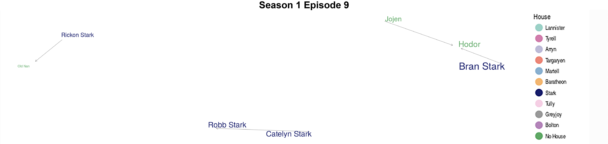
```

__Figure \@ref(fig:seas3eps)__ joins Bran, Hodor, and Jojen into a cluster since Bran and his protectors reach the Wall and cross into Wildling territory in search of the Three-Eyed Raven. 

Brienne of Tarth continues to carry out her promise to Catelyn Stark to return Jaime Lannister to King's Landing in order to trade him for Sansa. They are discovered by Locke a man-at-arms sworn to House Bolton who cuts off Jaime's sword hand.

Daenerys Targaryen flees Qarth after narrowly escaping the House of the Undying for Slaver's Bay where she buys the army of Unsullied, sets them free, then leads a revolt against the slave owners. Beyond the Wall, Jon Snow falls in love with Ygritte, a Wildling, while infiltrating Mance Rayder's Wildling army. Meanwhile, the White Walkers are on the move, threatening both the Seven Kingdoms and the land of the Free Folk. 

A notable mention in __figure \@ref(fig:seas3eps)__ is the connection between Rickon and Old Nan, his nanny. With only the single episode as data it is impossible to make gross season summaries and assess global patterns.

## Season 4 

Season 4 unfortunately had no data available to analyze. Rather than exclude the season a summary is provided below.

The fourth season continues to center around the War of the Five Kings. After some harrowing deaths five has become three: Joffrey Baratheon, Stannis Baratheon, and Balon Greyjoy, though Roose Bolton and Walder Frey add to the conflict by leveraging the war for more power. For their help in the murder of Robb Stark, the Bolton family is given control in the North while the Frey family runs Riverrun, though the castle is still under control of Brynden Tully.

The Lannister family controls most of Westeros except for parts of the North where the Greyjoys still occupy and Blackwater Bay where Stannis Baratheon and his men have retreated to recover from their losses in the Narrow Sea. Ramsay Bolton, the bastard son of Roose Bolton, is responsible for hunting down the remaining Ironborn men in the North. Ramsay tortures his captive and previous Winterfell keeper Theon Greyjoy.

Joffrey Baratheon meets his death by poison at his own wedding feast. Cersei blames her brother Tyrion for the murder even though Olenna Tyrell and Petyr Baelish secretly take credit for the death. Olenna advises Margaery to seduce Tommen Baratheon, the successor to the throne, while Sansa Stark escapes King's Landing with Petyr Baelish. Petyr and Sansa travel to the Vale where Sansa's Aunt Lysa Arryn takes her in and marries Petyr. Cersei orders Jaime to recapture Sansa. Instead Jaime directs Brienne of Tarth to find Sansa and return her to the North. As this is a massive undertaking he gifts Brienne his newly forged Valyrian steel sword and a squire Podrick Payne. Thus, repaying his debt to Catelyn Stark. A Lannister always pays his debts.

Meanwhile, in King's Landing Tyrion requests a trial by combat. Cersei picks Ser Gregor Clegane, also known as The Mountain, to fight on her behalf. Jaime and Bronn both are not willing to fight for Tyrion but Prince Oberyn Martell steps up to the challenge in order to claim revenge on The Mountain for raping and murdering his sister. Prince Oberyn nearly beats The Mountain and stabs him multiple times with a poisonous spear. He lets his guard down and The Mountain trips him and squishes his head until it explodes. Fortunately, Jaime helps Tyrion escape. Tyrion kills his ex-lover and back stabber, Shae, and his father, Tywin, while escaping King's Landing. Varys helps Tyrion onto a boat to Essos.

After helping liberate the slaves in Meereen the slave owners across Essos rise up in rebellion. Daenerys puts her return to Westeros on hold to deal with the uprising. Daenerys also learns that Ser Jorah Mormont originally befriends her as a spy for the Seven Kingdoms. She banishes him even after he professes his loyalty and love. The dragons must be locked up after they are found hunting livestock and people.

Bran Stark is beyond the Wall and finally meets the Three-Eyed Raven. Elsewhere in the North, Jon Snow returns to Castle Black and faces trial for defecting to the Wildling army. He convinces the elders that he joined the Wildlings to gain intel which includes a storming of Castle Black in the near future. Stannis Baratheon arrives at Castle Black after the Night's Watch lose a great deal of men and helps secure the Wall. Stannis believes he can work South from the North to take back his rightful seat on the Iron Throne.

Arya Stark spends most of season 4 traveling with The Hound. The two cross paths with Brienne and Podrick. Brienne realizes Arya's true identity then has an epic and brutal fight with The Hound over Arya. Brienne nearly kills The Hound but Arya doesn't trust Brienne so she hides, escapes, and begins her journey to Braavos to train under Jaqen H'ghar and become a member of the Faceless Men.

## Season 5 

```{r, echo = FALSE, eval = FALSE}
../../static/img = c(magick::image_read(path = "../../static/img/got_network/season5/final/episode1.png"),
        magick::image_read(path = "../../static/img/got_network/season5/final/episode2.png"),
        magick::image_read(path = "../../static/img/got_network/season5/final/episode3.png"),
        magick::image_read(path = "../../static/img/got_network/season5/final/episode4.png"),
        magick::image_read(path = "../../static/img/got_network/season5/final/episode5.png"),
        magick::image_read(path = "../../static/img/got_network/season5/final/episode6.png"),
        magick::image_read(path = "../../static/img/got_network/season5/final/episode7.png"),
        magick::image_read(path = "../../static/img/got_network/season5/final/episode8.png"),
        magick::image_read(path = "../../static/img/got_network/season5/final/episode9.png"),
        magick::image_read(path = "../../static/img/got_network/season5/final/episode10.png"))

season5episodes = magick::image_animate(../../static/img, fps = 0.1)
magick::image_write_gif(season5episodes, '../../static/img/got_network/season5/all_episodes.gif')
```

The network patterns are similar to previous seasons and geographic location starts as the largest indicator of connections and clusters. Episode 1 displayed in __figure \@ref(fig:seas5eps)__ shows connections between Stannis and Davos, Samwell Tarly and Alliser Thorne, and Cersei and Loras Tyrell all characters in the same location. Season 5 starts with a prophecy that Cersei Lannister will lose everyone and everything she holds dear. The prophecy seems well on its way to coming to fruition. Cersei tries everything in her power to prevent the prediction by controlling the fate of her remaining children Tommen and Myrcella.

The network moves away from spatial links and begins to build around the conflict. With Tommen Baratheon infatuated with his new wife Margaery Tyrell, Cersei is losing influence and control. Episode 3 shows the first connections between Cersei and the High Sparrow, the leader of a fanatical new religious sect Cersei recruits to dominate her enemies. At first this works, and in episode 4 Tommen, the High Sparrow, and Cersei are connected without Margaery since both Loras Tyrell and Margaery are arrested for homosexuality and perjury. Later though, Cersei herself is arrested for incest. Episode 6 shows the cluster of sinners, Cersei, Loras, Margaery, and Ser Lancel Lannister, all connected to the High Sparrow both directly and indirectly. After episode 6, this conflict and cluster subsides while Cersei herself is imprisoned. Through extensive physical and psychological torture, Cersei finally pleads guilty to having committed adultery with her cousin Lancel and is subject to a walk of shame through King's Landing. 

```{r, seas5eps, echo = FALSE, fig.align = "center", fig.cap = "The season 5 episode networks are presented. The networks are created using data from each unique episode and do not use cumulative information across episodes. The size of the character name indicates the the degree of their centrality."}
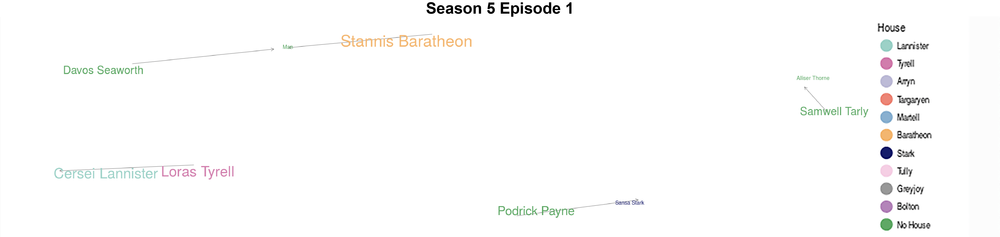
```

After episode 2 the network clusters grow in size. Episode 2 shows a large cluster connecting Catelyn Stark, Petyr Baelish, Brienne of Tarth, Sansa Stark, and Podrick Payne. Petyr marries Sansa to Ramsay Bolton in an effort to return her to her roots in the North. Ramsay can't even treat Sansa, a noble born, with dignity. The Boltons find their way into the network in a large way as central characters connected with other main characters. In episode 3 Roose and Ramsay are highly connected to Petyr, Sansa, Cersei, and Tyrion. They remain in the network connected to both major and minor characters up to episode 8. After this, Theon finally comes to his senses and helps Sansa escape Ramsay's extensive mis-treatment and Winterfell. They head North to find Jon Snow. 

Interestingly, part of Arya's kill list, Cersei and Walder Frey, is reflected in a cluster in episode 2. Besides these connections she is mainly connected to Jaqen H'ghar in episodes 2 and 3. Arya arrives on Braavos and finds her way to the House of Black and White. She struggles to become one of the Faceless Men and can't seem to leave her past behind to truly become no one. Arya is given an assassination mission and encounters Ser Meryn Trant. She deviates from her instructions from Jaqen H'ghar and kills Meryn, crossing his name off her kill list. As punishment Jaqen commits suicide and blinds Arya. She disappears from clusters in the network after episode 3 as she attempts to become no one.

Episode 4 joins Ellaria, Obara, and Nymeria Sand as they join forces to avenge Prince Oberyn Martell after his death in season 4. Myrcella Baratheon was shipped to Dorne, and in episode 9 shows ties to the Martell family, in an attempt to align House Martell and Lannister by having Myrcella wed to Trystane Martell. Ellaria, out to avenge her lover Prince Oberyn Martell, re-unites the sand snakes, Oberyn's bastard daughters Obara, Nymeria, and Tyene trained extensively by the "Red Viper" in combat. Cersei sends Bronn and Jaime to rescue Princess Myrcella and seemingly succeeds. On the boat returning to King's Landing, Myrcella dies after being poisoned by Ellaria Sand. All these characters and conflict are reflected in episodes 4 and 9.

In Essos, Daenerys deals with the Sons of the Harpy, an underground insurgency group opposing her rule, composed of the former slave owners. Tyrion and Varys continue their journey South where Jorah Mormont kidnaps Tyrion in order to offer him as a gift to Daenerys in an attempt to return to her good graces. Unfortunately, he is infected with greyscale, a terminal disease. In episode 8 Tyrion and Varys finally form a cluster with Daenerys as she accepts them into her inner circle as advisors to deal with the uprising of the Sons of the Harpy. Daenerys uses her dragon Drogon to take out majority of the Sons of the Harpy but after anhiliating most of the slave owners Drogon flies with Daenerys on his back into Dothraki territory where he leaves her.

Stannis and is represented in a number of clusters throughout episodes 1 through 6 since he emerges in the North at the Wall. Though Stannis saves Castle Black from a full Wildling invasion, he tends to be peripherally connected to other important characters. His minor role in the networks indicates his inconsequential purpose throughout the whole series. Stannis' camp is sabotaged when Ramsay's party destroy and siege equipment and food stores, while inflicting heavy losses on the army's horses. Stannis' attempt to conquer the North ends as Ramsay proves his miltant mind. Facing the cold of the North Stannis' army is deserting him so Stannis offers his daughter Shireen to the Lord of the Light through Melisandre's suggestion. Stannis is eventually defeated and Stannis is killed by Brienne of Tarth, who finally avenges her original master Renly Baratheon. Stannis feels more like a distraction from the parallel extreme conflict occuring with other characters.

Jon Snow refuses to join forces with Stannis sacrificing his chances of becoming Master of Winterfell in favor of becoming Lord Commander. With his new title, Jon's network grows beyond his family and the men in the Night's Watch for the first time in the series. He begins the season mainly attached to those he is serving beside, disappears from the middle portion episodes, and finishes with connections to Tormund (episode 8), a leader of the Free Folk, and Melisandre (episode 10). As Lord Commander Jon heads beyond the Wall to try to unite the Wildlings and the Night's Watch in an alliance to fight the White Walkers. The White Walkers attack and as Jon Snow and the surviving Wildlings narrowly escape they watch as their dead comrads are bought back as Wights explaining his new connection with Tormund in the network. Jon returns after the battle to find out Maester Aemon is dead and Samwell Tarly was sent to train to be the next Maester. Jon and Sam remain connected in clusters throughout the episodes in season 5. Jon's new connections to characters outside of Castle Black cause fellow Night's Watch men turn on him and stab him "for the watch" leaving him in the cold to die. 

The network developed using data across all episodes in season 5 (__figure \@ref(fig:seas5)__) becomes more dense than previous seasons. Deservedly, Petyr Baelish is the most central character in season 5. Jaime and his cluster in Dorne, Daenerys and her cluster in Slaver's Bay, and Davos' special relationship with Shireen describe a few small clusters that make up the season 5 network. These characters and those in their clusters are geographically separated from the main conflict throughout the season explaining their isolated small clusters. In the end, HBO producers distract us with all their conflict, except Daenerys', and their conflict ends in death and unsuccessful missions. The larger cluster of characters begins to join Lannister, Tyrell, Stark, Baratheon, Bolton, and Greyjoy houses together. Petyr has ties to each of these houses, mainly Stark, Lannister, and Bolton, and is unsurprisingly the most central character in the season. These families are joined loosely by Jon Snow and the Night's Watch in the North at the Wall. The uniting of these important houses and characters finally joins the number of smaller plot lines into a single more cohesive game. 

```{r, seas5, echo = FALSE, fig.align = "center", fig.cap = "The season 5 cumulative network is presented. The network is created using data across all episodes in season 5. The size of the character name indicates the the degree of their centrality."}
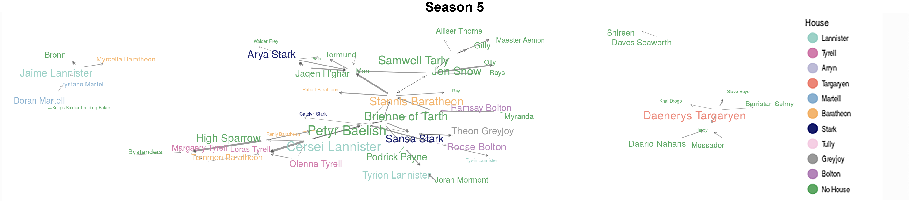
```

## Season 6

```{r, echo = FALSE, eval = FALSE}
../../static/img = c(magick::image_read(path = "../../static/img/got_network/season6/final/episode1.png"),
        magick::image_read(path = "../../static/img/got_network/season6/final/episode2.png"),
        magick::image_read(path = "../../static/img/got_network/season6/final/episode3.png"),
        magick::image_read(path = "../../static/img/got_network/season6/final/episode4.png"),
        magick::image_read(path = "../../static/img/got_network/season6/final/episode5.png"),
        magick::image_read(path = "../../static/img/got_network/season6/final/episode6.png"),
        magick::image_read(path = "../../static/img/got_network/season6/final/episode7.png"),
        magick::image_read(path = "../../static/img/got_network/season6/final/episode8.png"),
        magick::image_read(path = "../../static/img/got_network/season6/final/episode9.png"),
        magick::image_read(path = "../../static/img/got_network/season6/final/episode10.png"))

season6episodes = magick::image_animate(../../static/img, fps = 0.1)
magick::image_write_gif(season6episodes, '../../static/img/got_network/season6/all_episodes.gif')
```

Season 5 deviates from previous season finale patterns. In seasons 1 through 4, typically the most exciting conflict happens in the episodes leading up to the finale and the finale itself resolves the plot or sets up for future seasons. In season 5 Stannis battles for the North and is killed by Brienne, Theon finally turns against Ramsay and helps Sansa escape his torturous ways in Winterfell, Arya is blinded for violating her mission with the Faceless Men, Ellaria poisons and kills Myrcella in front of Jaime, after attacking the Sons of the Harpy Daenerys' dragon takes her into Dothraki territory, Cersei has her walk of shame, and Jon Snow is stabbed by his fellow Night's Watch. We are left with the frame panning into Jon laying in the snow, possibly alive or dead. Most pivotal characters conflict is left open to resume in season 6.

Season 6 therefore, starts more chaotic than previous seasons right in the middle of the conflict left open from season 5. In seasons 1 through 4, Jon's cluster was mostly populated by Samwell Tarly, Gilly, and others in the Night's Watch. In season 5, Jon's network diversifies and he is often connected to Tormund and Davos Seaworth. After being brought back to life by Melisandre in episode 1 (see __figure \@ref(fig:seas6eps)__), Jon's network continues to expand throughout season 6. In early portions of the season like episode 3 his cluster includes classic connections to Sam and Gilly but by episodes 5, 7, 9 and 10 his network grows to include Sansa, Davos, Ramsay, Lyanna Mormont, Stannis, Tormund, and Melisandre. Jon fufilled his oath to the Night's Watch and "lived and died by his post." He is liberated and leaves the Wall to take back Winterfell from the Boltons. The network surrounding Jon reflects his quest to join the houses in the North. Jon's cluster also includes Sansa since they are reunited in episode 4. Sansa is helping Jon rally the Northern families. Even with a reunited North, Jon and Sansa don't have the numbers to re-take Winterfell from Ramsay Bolton. 

```{r, seas6eps, echo = FALSE, fig.align = "center", fig.cap = "The season 6 episode networks are presented. The networks are created using data from each unique episode and do not use cumulative information across episodes. The size of the character name indicates the the degree of their centrality."}
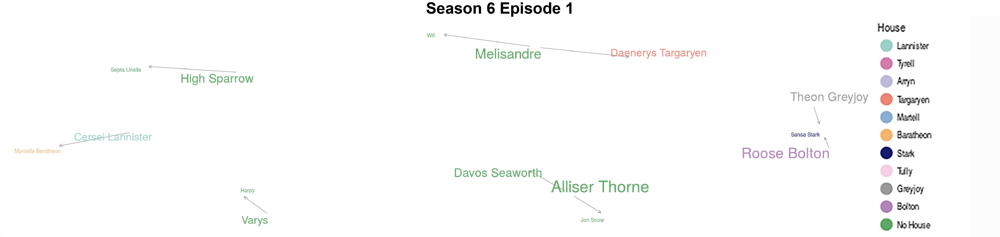
```

Since Jon and Sansa are reunited with a common goal, their networks and conflict overlap in most of season 6. Unlike Jon, Sansa's connections over the previous seasons persist and she has an extensive number of connections with a diverse set of characters throughout the season. Mainly, she still has ties to Petyr Baelish and Rob (Robin) Arryn (episode 4) the controlling power in the Vale.

Both Jon and Sansa, and their clusters, come to head in episode 9, the Battle of the Bastards. Ramsay holds Rickon Stark hostage so even with fewer men and a warning from Sansa Jon takes on Ramsay. Rickon is the first casualty and Ramsay's creative battle strategy at first, annihilates Jon and his army. Sansa's networking with Petyr and Rob comes in handy and Petyr arrives on the battlefield just in time with the soldiers from the Vale. Later, Sansa gets her revenge on Ramsay by feeding him to his own hounds and hopefully episode 9 is the last time we see Sansa tied to Ramsay in the network. After the battle, Jon is voted and declared King in the North. Sansa learns from Brienne that Arya is still alive.

Arya is somewhat absent from the network in season 6. She appears only in episode 3 connected to The Waif and in episodes 5 and 8 connected to Lady Crane. As a blind girl, Arya is having a tough time in Braavos and finally begins to accept Jaqen H’ghar's teachings to become no one. Arya is given another chance to prove herself by assasinating Lady Crane, a seemingly good person. Arya promises to go through with the assassination despite her misgivings but eventually rebels and saves Lady Crane. Arya is stabbed by The Waif for the insubordination and Lady Crane finds and cares for Arya. Eventually, The Waif returns and kills Lady Crane and comes to finish Arya but Arya outsmarts her, kills her, and escapes. Arya proves once and for all that a girl is not no one, a girl is Arya Stark.

Similar to Jon and Sansa, Cersei finds herself surrounded by more enemies than allies. In episode 4, Cersei's cluster includes Loras Tyrell, Margaery Tyrell, the High Sparrow, Jaime Lannister, and Tommen. Cersei's only ally in this cluster is Jaime. Cersei is navigating the conflict to survive while keeping Tommen alive and attempting to gain back her power from the High Sparrow. In King's Landing the High Sparrow has begun to influence Tommen more effectively than Cersei. In episode 8, Tommen, through the advice of the High Sparrow, outlaws trial by combat leaving Cersei with the very real possibility of being found guilty for incest. In this episode, Tommen is connected to both Cersei and Loras Tyrell and by choosing to ban trial by combat is effectively choosing his wife Margaery over his mother Cersei. Cersei uses wildfire in episode 10 to blow up the Great Sept of Baelor during the trials of Loras and Margaery Tyrell killing most of her enemies in one fell swoop. This explosion is early in the trials and so episode 10 only shows connections between the High Sparrow and Loras and separately Margaery and Cersei rather than a large cluster to reflect the conflict. Tommen is so distraught he commits suicide by jumping from the window thus fulfilling the prophecy and leaving Cersei with nothing. Cersei ascends to the Iron Throne but has lost everything along the way.

In episode 3, the Dothraki make a comeback as Dothraki Matron and Khal Drogo appear in the network. Episode 4 continues this trend and Khal Moro and Khal Drogo are included in the network. At the end of season 5, Daenerys is dragged off by her dragon Drogon to the city of Vaes Dothrak, the city of the Dothraki people. The Dothraki find her and force her to live among the other Khal widows. Episodes 1, 3, and 4 show connections between Varys and the Sons of the Harpy since Varys and Tyrion are left to deal with the Sons of the Harpy and maintain order in Slaver's Bay while Daenerys is away. By episode 5, Tyrion and Daenerys are connected again. In true Daenerys, Queen of Dragons form, she burns the Khals alive, takes control of the Dothraki army, and returns to Slaver's Bay. 

In episode 5, we are introduced to a new character in the network, Euron Greyjoy. Euron is the Balon Greyjoy's bad apple brother. Euron murders Balon, the King of the Iron Islands, early in the season and challenges Yara for the crown. Yara and Theon flee to escape Euron and find themselves connected in episode 7 as they decide whether to join forces with Daenerys.

The War of the Five Kings has ended and now the conflict shifts to the Lannisters versus the Targaryens. Only Bran and to some extent Jon realize that the true enemy is the White Walkers. Bran, Hodor, and Meera are connected in episodes 1 and 5. Bran's maturing powers allow him to view the past. He discovers the White Walkers were created by the Children of the Forest to protect themselves from the First Men. In a journey into the past, Bran learns that Jon Snow is actually the son of Lyanna Stark.

The cumulative season 6 network shown in __figure \@ref(fig:seas6)__ displays Sansa Stark and Jaime Lannister as the most central characters. Sansa intuitively is central since is uniting the North to fight Ramsay and brings her ties from King's Landing into the conflict. Jaime on the other hand is somewhat surprising since he really has no conflict of his own this season. For the most part, he is just working to support Cersei. The cumulative network in season 6 is the largest of all the aired seasons including season 7. All of the individual plot lines in season 6 climax and resolve somewhat setting up season 7 to focus on the final cohesive plot line against the White Walkers.

```{r, seas6, echo = FALSE, fig.align = "center", fig.cap = "The season 6 cumulative network is presented. The network is created using data across all episodes in season 6. The size of the character name indicates the the degree of their centrality."}
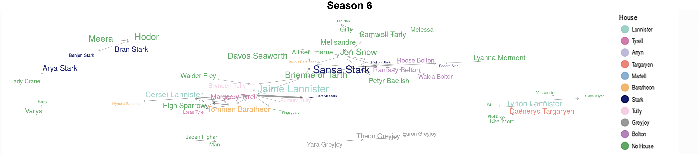
```

The season 6 network in __figure \@ref(fig:seas6)__ also shows the cluster around Hodor is very small, it just includes Bran and Meera, but Hodor himself is one of the most central characters in the season. In fact, across all the seasons Hodor is one of the most central characters. Hodor plays a pivotal role in allowing Bran to see the origins of the White Walkers and due to this may be one of the most important characters in the series.

## Season 7

```{r, echo = FALSE, eval = FALSE}
../../static/img = c(magick::image_read(path = "../../static/img/got_network/season7/final/episode1.png"),
        magick::image_read(path = "../../static/img/got_network/season7/final/episode2.png"),
        magick::image_read(path = "../../static/img/got_network/season7/final/episode3.png"),
        magick::image_read(path = "../../static/img/got_network/season7/final/episode4.png"),
        magick::image_read(path = "../../static/img/got_network/season7/final/episode5.png"),
        magick::image_read(path = "../../static/img/got_network/season7/final/episode6.png"))

season7episodes = magick::image_animate(../../static/img, fps = 0.1)
magick::image_write_gif(season7episodes, '../../static/img/got_network/season7/all_episodes.gif')
```

Seasons 5 and 6 kill off a most major and minor characters leaving the network across season 7 somewhat sparse. The season 7 network is mostly populated by the major characters that have survived the game of thrones. Episode 1 is only filled by 9 characters in the network. Episode 2 and 3 quickly grow and unite the remaining houses. Episodes 2 and 3 show the Starks, Lannisters, Targaryens, and Tyrells have all finally connected into a single cluster. This is the first time these families are all jointly connected. After their loved ones are killed by Cersei Lannister even House Tyrell and Sands pledge their allegience to Daenerys. Episode 2 shows Daenerys and Olenna Tyrell connected. The network in the second to last season focuses on the convergence of the show's characters and main plotlines to set up the conflict in the final season.

Arya takes Walder Frey's face, kills him, and poisons the other members of the Frey family. This isn't present in the network because she is Walder as she carries out the murder to avenger her brother and mother. In episode 2, presented in __figure \@ref(fig:seas7eps)__, Arya meets Ed Sheeren and is reunited with Hot Pie. Hot Pie tells Arya Winterfell is once again safe and the King in the North is none other than Jon Snow. She returns home to Winterfell and is reunited with Sansa and Bran.

```{r, seas7eps, echo = FALSE, fig.align = "center", fig.cap = "The season 7 episode networks are presented. The networks are created using data from each unique episode and do not use cumulative information across episodes. The size of the character name indicates the the degree of their centrality."}
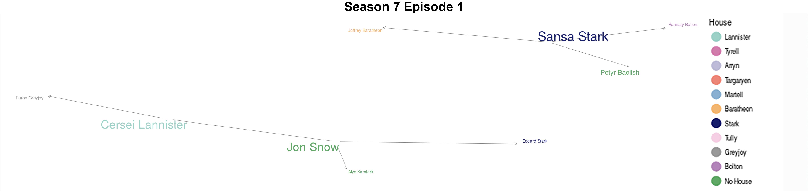
```

Sam discovers and alerts Jon that Dragonstone is full of Dragonglass. Jon just misses Arya's return to Winterfell and arrives at Dragonstone to mine the glass in order to create weapons to fight the White Walkers. Episode 2 shows Jon connected to Tyrion since Tyrion is his reference into meeting Daenerys and in episode 3 we see Daenerys and Jon are directly joined in a cluster. In an effort to defeat the Army of the Dead, Jon, the King in the North, bends the knee to Daenerys. Daenerys struggles to believe the White Walkers exist until Jon shows her the cave art of the White Walkers proving to her the reality of the threat. Meanwhile in episode 2, Sam becomes connected to Jorah Mormont while he is studying at the Citadel to become a Maester. Ser Jorah Mormont contracted greyscale and Sam finds an ancient, experimental, and painful method to cure the otherwise terminal illness. Against his mentor's instructions, he treats and cures Jorah who eventually returns to Daenerys to serve loyally. With the imminent attack of the White Walkers, Sam loses his patience at the slow pace of learning at the Citadel, takes some useful books, and heads North.

Euron wastes no time and in episode 1 is already connected to Cersei in King's Landing. Euron courts Cersei and offers her revenge in exchange for her hand in marriage. Cersei agrees to marry Euron after the war is over if he is able to bring her Ellaria Sand and her daughters. Not present in the network is the conflict between Euron, Theon, Yara, and Ellaria. Euron finds Yara and Theon's fleet and takes Yara, Ellaria Sand, and Tyene Sand. Rather than fight for his sister and the Sands, Theon abandons ship. Euron and Cersei are connected again in episode 3 when Euron delivers his dowry. Cersei tortures Ellaria by poisoning Tyene in front of her, similar to Myrcella's death.

Together Euron and Cersei fight Daenerys and her massive army. Episode 3 shows the Lannister siblings in a cluster together though not always directly connected. Tyrion predicts a large force to hold Casterly Rock given that it is the home of House Lannister and the Lannister family had never relinquished power. However, Jaime Lannister anticipated Tyrion's move and used Casterly Rock as a distraction, and instead marched the Lannister army South to High Garden while the Iron Fleet destroyed the Targaryen fleet that had brought the Unsullied. Jaime takes High Garden and their money and resources but not before a final conversation with Olenna Tyrell. Jaime gives Olenna a poison that will kill her peacefully and after drinking it she tells Jaime "Must have been horrible for you as a Kingsguard, as a father. It was horrible enough for me, a shocking scene. Not at all what I intended. You see, I had never seen the poison work before. Tell Cersei. I want her to know it was me." Finally admitting, she killed Joffrey. In episode 5, we finally see the Lannister siblings directly related in a cluster as Jaime does in fact tell Cersei that Olenna murdered Joffrey.

Daenerys does not take the lost battle well and takes the Dothraki as well as her dragon Viserion to attack Jaime and Bronn and their newly looted riches. She burns everything, including Randyll and Dickon Tarly, but not before Bronn uses the dragon machine gun to injure Viserion. Surprisingly, Daenerys is not present in the episode 4 network when this conflict occurs. The network in episode 4 is very sparse and goes back to location being the biggest indicator of character ties.

The Hound, Sandor Clegane, appears in the network in episode 10 after he joins the brotherhood and finally sees the White Walkers as a threat. Tyrion devises a plan to unite everyone against the White Walkers by delivering a wight to Cersei. The Hound and the brotherhood go beyond the Wall encounter a zombie bear, find a group of wights, and capture one to take to Cersei. Gendry runs for help just as the big army arrives. Daenerys shows up with her dragons and saves the day but not before the Night King shoots and kills Viserion. The Night King turns Viserion into an ice dragon. The network does not reflect this plot.

Everyone meets in King's Landing to see the wight. Previously location tied characters together but the network does not capture the meeting between the remaining powerhouses. Euron is unwilling to unite against the wights and leaves. Cersei agrees to join and help if Jon promises not to attack her after the Great War is over. Jon can't make that promise but luckily Tyrion convinces Cersei. Theon goes to save Yara from Euron and Jon and Daenerys make their way back to Winterfell. Cersei tells Jaime she is pregnant that she will not send support North to fight against the White Walkers. Jaime leaves for the North to keep his promise to protect the realm.

Meanwhile in Winterfell, Sansa and Arya team up and try Petyr Baelish for his treasonous crimes. In episode 1 Sansa has a cluster of connections to the men, Joffrey, Petyr, and Ramsay, who tortured and used her over the years. This small cluster foreshadows Sansa taking her destiny into her own hands and not relying on the men around her to protect her. The player gets played and Petyr is sentanced to death. 

Sam makes it to Winterfell and with Bran finds out Jon's real name is Aegon Targaryen. Jon is the son of Lyanna Stark and Rhaegar Targaryen. Jon Snow, or Aegon Targaryen, is the rightful heir to the Iron Throne. Jon and Daenerys have some x-rated time in the boat on the way back to Winterfell and the Night King gets to the Wall with the Army of the Dead and his new dragon. To say the least, he destroys it. 

The season 7 episode networks do not reflect the conflict present across the season. Likely, because season 7 is setting up for season 8. The season 7 cumulative network is shown in __figure \@ref(fig:seas7)__ and proves slightly more descriptive.

```{r, seas7, echo = FALSE, fig.align = "center", fig.cap = "The season 7 cumulative network is presented. The network is created using data across all episodes in season 7. The size of the character name indicates the the degree of their centrality."}
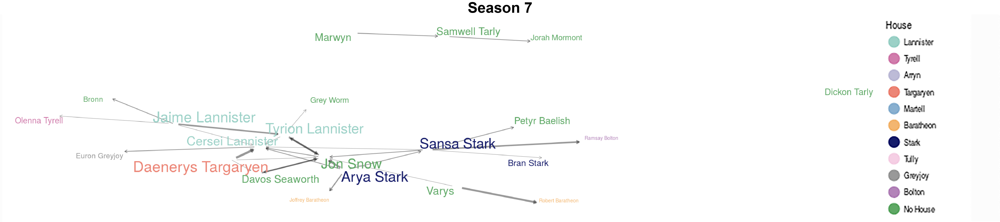
```

The most central characters in season 7 are Daenerys, Arya, and Sansa. While Daenerys' centrality is clear, Arya and Sansa aren't as evident. The cumulative network shows the ties between Tyrion, Cersei, Daenerys, Arya, and Jon and the merging of the minor plot lines for the final season. Notably, the season 7 network is substantially smaller than the previous seasons cumulative networks.

## General Themes

```{r, echo = FALSE, eval = FALSE}
../../static/img = c(magick::image_read(path = "../../static/img/got_network/season1/final/episode1.png"),
        magick::image_read(path = "../../static/img/got_network/season1/final/episode2.png"),
        magick::image_read(path = "../../static/img/got_network/season1/final/episode3.png"),
        magick::image_read(path = "../../static/img/got_network/season1/final/episode4.png"),
        magick::image_read(path = "../../static/img/got_network/season1/final/episode5.png"),
        magick::image_read(path = "../../static/img/got_network/season1/final/episode6.png"),
        magick::image_read(path = "../../static/img/got_network/season1/final/episode7.png"),
        magick::image_read(path = "../../static/img/got_network/season1/final/episode8.png"),
        magick::image_read(path = "../../static/img/got_network/season1/final/episode9.png"),
        magick::image_read(path = "../../static/img/got_network/season1/final/episode10.png"),
        magick::image_read(path = "../../static/img/got_network/season2/final/episode1.png"),
        magick::image_read(path = "../../static/img/got_network/season2/final/episode2.png"),
        magick::image_read(path = "../../static/img/got_network/season2/final/episode3.png"),
        magick::image_read(path = "../../static/img/got_network/season3/final/episode9.png"),
        magick::image_read(path = "../../static/img/got_network/season5/final/episode1.png"),
        magick::image_read(path = "../../static/img/got_network/season5/final/episode2.png"),
        magick::image_read(path = "../../static/img/got_network/season5/final/episode3.png"),
        magick::image_read(path = "../../static/img/got_network/season5/final/episode4.png"),
        magick::image_read(path = "../../static/img/got_network/season5/final/episode5.png"),
        magick::image_read(path = "../../static/img/got_network/season5/final/episode6.png"),
        magick::image_read(path = "../../static/img/got_network/season5/final/episode7.png"),
        magick::image_read(path = "../../static/img/got_network/season5/final/episode8.png"),
        magick::image_read(path = "../../static/img/got_network/season5/final/episode9.png"),
        magick::image_read(path = "../../static/img/got_network/season5/final/episode10.png"),
        magick::image_read(path = "../../static/img/got_network/season6/final/episode1.png"),
        magick::image_read(path = "../../static/img/got_network/season6/final/episode2.png"),
        magick::image_read(path = "../../static/img/got_network/season6/final/episode3.png"),
        magick::image_read(path = "../../static/img/got_network/season6/final/episode4.png"),
        magick::image_read(path = "../../static/img/got_network/season6/final/episode5.png"),
        magick::image_read(path = "../../static/img/got_network/season6/final/episode6.png"),
        magick::image_read(path = "../../static/img/got_network/season6/final/episode7.png"),
        magick::image_read(path = "../../static/img/got_network/season6/final/episode8.png"),
        magick::image_read(path = "../../static/img/got_network/season6/final/episode9.png"),
        magick::image_read(path = "../../static/img/got_network/season6/final/episode10.png"),
        magick::image_read(path = "../../static/img/got_network/season7/final/episode1.png"),
        magick::image_read(path = "../../static/img/got_network/season7/final/episode2.png"),
        magick::image_read(path = "../../static/img/got_network/season7/final/episode3.png"),
        magick::image_read(path = "../../static/img/got_network/season7/final/episode4.png"),
        magick::image_read(path = "../../static/img/got_network/season7/final/episode5.png"),
        magick::image_read(path = "../../static/img/got_network/season7/final/episode6.png"))

all_season_episodes = magick::image_animate(../../static/img, fps = 0.1)
magick::image_write_gif(all_season_episodes, '../../static/img/got_network/cumulative/all_season_episodes.gif')
```

```{r, echo = FALSE, eval = FALSE}
../../static/img = c(magick::image_read(path = '../../static/img/got_network/cumulative/within season/final/season1.png'),
        magick::image_read(path = '../../static/img/got_network/cumulative/within season/final/season2.png'),
        magick::image_read(path = '../../static/img/got_network/cumulative/within season/final/season3.png'),
        magick::image_read(path = '../../static/img/got_network/cumulative/within season/final/season5.png'),
        magick::image_read(path = '../../static/img/got_network/cumulative/within season/final/season6.png'),
        magick::image_read(path = '../../static/img/got_network/cumulative/within season/final/season7.png'))

all_seasons = magick::image_animate(../../static/img, fps = 0.1)
magick::image_write_gif(all_seasons, '../../static/img/got_network/cumulative/all_seasons.gif')
```

While digging into the network patterns on the micro-episode scale I noticed some interesting patterns more globally. HBO tends to slowly build conflict then have a massive episode or two in a row. __Figure \@ref(fig:alleps)__ below rotates between all networks produced from each episode across the series.

```{r, alleps, echo = FALSE, fig.align = "center", fig.cap = "Episode networks are presented across all seasons. The networks are created using data only from each unique episode and do not use cumulative information across episodes or seasons. The size of the character name indicates the the degree of their centrality."}
knitr::include_graphics('../../static/img/got_network/cumulative/all_season_episodes.gif')
```

__Figure \@ref(fig:number)__ plots the total number of characters in the network across each season and episode. The first thing that jumps out is that the number of characters in the show is constantly rising and falling in a pattern consistent with a repeated pattern of exciting episodes followed by some relief. Generally, the seasons start with very little conflict, shown by the sparse networks across episodes 1-2. Then the conflicts builds in episodes 3-5 and the network structures grow in size indicating lots of character conflict in these sets of episodes. After we have been emotionally beat up, the networks lean out again for episodes 6-7 and then tend to climax around episodes 8 and 9. These episodes again grow in size similar to episodes 3-5. Episode 10 normally ties up loose ends from the season and provides some relief from major conflict often setting the scene for the upcoming season. This pattern is made clear by the sin-wave like trend in seasons 5 through 7 in __figure \@ref(fig:number)__.


```{r, number, echo = FALSE, fig.align = 'center', fig.cap = 'A scatter plot with lines connecting points is presented. The number of characters in the network is plotted against the season and episode indicator. The figure shows a sin-wave pattern where the number of characters in the constantly network grows and then falls only to grow again. Typically, the first portion of the season shows a rising trend while the end of the season shows a decline.'}
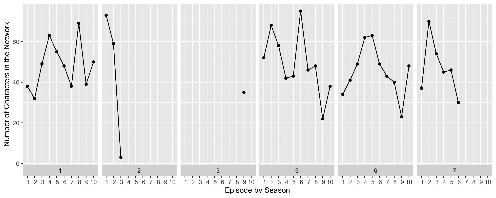
```

My friend [Jordan Dworkin](https://www.jordandworkin.com/) found a similar conflict pattern using a sentiment analysis on the Stranger Things scripts. He notes across season 1 and 2 of Stranger Things the overall episode sentiment constantly rotates between ordinally between episodes that begin and end with neutral emotion and have slow fluctuations in the middle, episodes that begin with negative emotion and gradually climb towards a positive ending, and episodes that begin on a positive note and oscillate downwards towards a darker ending. 

These similar findings are likely in order to give veiwers some relief after a particularly exciting episode and excite veiwers after more boring episodes. 

```{r, echo = FALSE, eval = FALSE}
library(dplyr)
library(stringr)
library(ggplot)

# Load clean data
# tbl called clean_data
load('/Users/alval/Box/Research/GoT_shiny/clean_data.RData')

# Load speaking character data
load('/Users/alval/Box/Research/GoT_shiny/speaking_characters.RData')

# Create a no spaces character name
speaking_characters = speaking_characters %>% 
  dplyr::mutate(no_space_names = stringr::str_replace_all(speaker, " ", "_"))

# node data
clean_data = clean_data %>%
  dplyr::select(season, episode, speaker, starts_with("name"), 
                single_spoken_str) %>%
  dplyr::mutate(single_spoken_str  = trimws(single_spoken_str)) %>%
  dplyr::filter(single_spoken_str != "") %>%
  tidyr::gather(key = speaker_number, value = "tospoken",
                starts_with("name")) %>%
  dplyr::arrange(speaker, season, episode, speaker_number) %>%
  dplyr::mutate(tospoken = trimws(tospoken)) %>%
  dplyr::filter(tospoken != "") %>%
  dplyr::group_by(speaker, season, episode, tospoken) %>%
  dplyr::tally() %>% 
  ungroup() %>% 
  select(speaker, tospoken, everything()) %>% 
  rename(weight = n) %>% 
  arrange(season, episode, speaker, weight)

n_network = clean_data %>% 
  group_by(season, episode) %>% 
  tally()

character_number_plot = ggplot(n_network, aes(episode, n)) + 
  facet_grid(. ~ season, switch = 'x') + 
  geom_point() + 
  geom_line() +
  scale_x_discrete(limits = 1:10) +
  xlab('Episode by Season') +
  ylab('Number of Characters in the Network')

ggsave(filename = '../../static/img/got_network/character_number_plot.png', plot = character_number_plot, units = "in", width = 10, height = 4)
```

A few characters are worth following across all the networks throughout the series. The cluster surrounding Cersei constantly grows and thins. This pattern reflects Cersei's plotline throughout the series. She either kills those she is in conflict with, or they kill those that are close to her for revenge. Cersei's network is also normally filled with characters that she has direct conflict with. While in the show she seems to always be a step ahead, the cluster pattern indicates she is more narrow minded and deals with drama coming head on rather than strategizing for the long-term game of thrones.

The cluster surrounding Arya is also one worth following. Arya's network, similar to Cersei, is filled almost exclusively with characters she loves or wants to kill. She also constantly goes from full to sparse networks throughout the series. Arya is personally my favorite character so when I noticed parallels between her and Cersei, my least favorite character, I was so sad I put down the project for a few weeks. In this time off I tried to think about how Cersei and Arya were different qualitatively. In the end, I noticed that Cersei and Arya feircly protect those they love but Cersei just as fiercly tries to preserve her power position. Cersei is never willing to sacrifice her power for those that she loves.

Lastly, the season 7 episode networks were unremarkable. While there is still quite a bit of conflict in season 7, the networks don't quantitatvely capture the excitment. The graphic below, taken from [https://blog.reedsy.com/narrative-arc/](https://blog.reedsy.com/narrative-arc/), shows the universal story arc. 

```{r, echo = FALSE, fig.align='center'}
knitr::include_graphics('../../static/img/got_network/lit_journey.jpg')
```

Back in my seventh grade english class (shout-out to Mrs. McCarty), I learned that this is the common plot structure for story telling. Game of Thones revolutionized TV by regularly killing off main characters. While it has been radical in surprising the viewer, I don't think it will go against the universal story arc. Season 1 was the exposition with Ned's death the inciting incident. Seasons 2-5 are the rising action and season 6 was the climax. Season 7 begins the falling action. Season 8 will hold the resolution and have some mini-climax related to the White Walkers.

For fun, __figure \@ref(fig:allseas)__ shows the network grow across seasons.

```{r, allseas, echo = FALSE, fig.align = "center", fig.cap = "Episode networks are presented across all seasons. The networks are created using data only from each unique episode and do not use cumulative information across episodes or seasons. The size of the character name indicates the the degree of their centrality."}
knitr::include_graphics('../../static/img/got_network/cumulative/all_seasons.gif')
```

The Walls watch has ended but until season 8 our watch begins.

## Acknowledgments

First and foremost thank you George R.R. Martin for imagining and sharing Game of Thrones with the world. Thank you HBO for transforming the text to live action. [John Muschelli](https://johnmuschelli.com/) was invaluable to this project and helped me scrape and analyze these data. This project would also not be possible without Taki Shinohara giving me the space and freedom to pursue this project independent of my other work related research and duties. My sister Cristina Valcarcel graciously helped me edit the work.

The views expressed in this post are solely those of the author.
